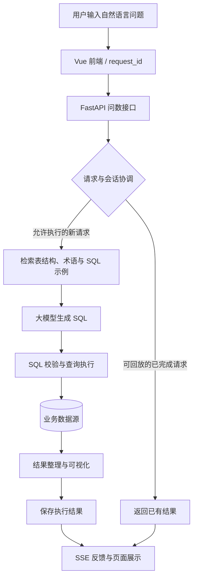

# Campus SqlAssistant · 校园智能问数助手

面向校园学情分析的自然语言问数项目，基于 **SQLBot** 二次开发，结合 **LLM、RAG 与 Text-to-SQL**，将关于成绩、挂科、排名等业务问题转换为 SQL 查询，并以表格、图表和文字呈现结果。

项目也以 **QueryData** 作为实践名称。开发重点是校园业务知识检索、问数请求的稳定执行，以及能够追踪问题和对比改进效果的评测流程。

> 基础问数、数据源管理、模型接入及可视化能力来自 SQLBot。本仓库在此基础上开展校园场景适配与工程实践，保留上游来源与许可证。

## 应用场景

| 场景 | 提问示例 |
| --- | --- |
| 成绩查询 | 查询某班本学期各门课程的成绩分布。 |
| 挂科分析 | 统计目前仍有未通过课程的学生人数。 |
| 历史与当前状态区分 | 哪些学生曾经不及格，但目前已经通过？ |
| 学业排名 | 按已有报表中的加权成绩列出班级前十名。 |
| 综合分析 | 比较不同班级的平均成绩和课程通过情况。 |

查询依赖实际接入的数据、字段说明与业务口径。例如“曾不及格”和“尚不及格”需要分别定义；GPA、加权成绩及排名优先使用报表已有字段，避免让模型自行猜测计算规则。

## 主要能力

### 自然语言问数与业务知识检索

- 接入数据库或 Excel 数据，结合表结构和字段信息生成 SQL。
- 通过专业术语、同义词和 SQL 示例补充模型上下文，支持校园业务口径配置。
- 基于文本匹配与向量检索召回相关知识，配套校园术语评测和参数对照实验。
- 以 SSE 流式反馈问数过程，展示 SQL、查询结果及图表。

### 请求防重与结果回放

- 使用 `request_id` 标识一次问数请求，区分重复提交与新的提问。
- 通过 Redis 请求锁和会话锁协调执行，避免重复请求或同一会话中的并发任务重复推进。
- 使用锁续期与执行权校验管理长耗时任务。
- 保存完成结果，为满足回放条件的重复请求返回已有结果，减少重复模型调用。
- 提供请求校验、锁协调、暂停和回放相关测试。

### 复杂 Excel 报表导入

- 支持多级表头预览与选择，将层级表头展开为可查询字段。
- 处理合并单元格、重复列名和超长字段名，建立表头与数据库字段之间的映射。
- 将报表导入 PostgreSQL，为后续表结构检索和 SQL 生成提供字段信息。
- 提供导入逻辑、接口及 PostgreSQL 集成测试，设计说明见 [Excel 多级表头导入](docs/excel-multiheader-import-design.md)。

### 可追踪的评测流程

- **术语召回评测**：比较词语匹配、混合召回及解释文本参与向量化等方案，记录 Precision、Recall、负例误召回和多术语命中情况。
- **端到端问数评测**：串行提交问题，关联会话和请求，采集 SQL、查询结果、执行状态与错误信息。
- **评分与导出**：生成离线评分材料，校验评分 JSON，支持导出 Excel 成绩单。
- **可复核记录**：保存题集、评分规则、运行记录和证据，便于分析失败原因和比较不同版本。

术语召回指标与 SQL 结果正确性分别评估；固定题集上的实验结果不等同于真实用户流量的整体效果。具体实验设置见各评测工具文档。

## 技术栈

| 层次 | 技术 |
| --- | --- |
| 前端 | Vue 3、TypeScript、Vite、Element Plus、Pinia |
| 后端 | Python 3.11、FastAPI、Pydantic、SQLModel、Alembic |
| 模型与检索 | LangChain、Hugging Face Embeddings、pgvector |
| 存储与协调 | PostgreSQL、Redis |
| 表格处理 | pandas、openpyxl、python-calamine |
| 可视化与通信 | AntV G2、SSE |
| 评测 | Python CLI、JSON 运行记录、Excel 成绩单 |

## 问数流程



## 本地开发

以下以 **Ubuntu / WSL2** 为例。需要准备 Python 3.11、uv、Node.js 与 npm、支持 pgvector 的 PostgreSQL、Redis，以及可访问的大模型服务。

### 1. 获取源码与安装依赖

```bash
git clone https://github.com/Wangzhijie-star/Campus_SqlAssistant.git
cd Campus_SqlAssistant

cd backend
uv sync --extra cpu
cd ../frontend
npm install
cd ..
```

后端依赖及包索引以 `backend/pyproject.toml` 为准，其中包含 `sqlbot-xpack` 等依赖；安装环境需要能够访问配置的包索引。

### 2. 准备数据库、模型和配置

提前创建应用数据库及数据库用户，安装 pgvector 扩展，并确认 Redis 可连接。后端启动时会运行 Alembic 迁移，数据库用户需要具备相应的建表及迁移权限。

将 `shibing624/text2vec-base-chinese` 模型文件准备到以下目录结构：

```text
<模型根目录>/
└── embedding/
    └── shibing624_text2vec-base-chinese/
```

在**项目根目录**创建 `.env`，按实际环境填写，例如：

```dotenv
PROJECT_NAME=Campus SqlAssistant
SECRET_KEY=replace-with-a-generated-random-secret
DEFAULT_PWD=replace-with-your-initial-login-password

POSTGRES_SERVER=127.0.0.1
POSTGRES_PORT=5432
POSTGRES_DB=sqlbot
POSTGRES_USER=sqlbot
POSTGRES_PASSWORD=replace-with-your-database-password

FRONTEND_HOST=http://localhost:5173
BACKEND_CORS_ORIGINS=http://localhost:5173

IDEMPOTENCY_REDIS_URL=redis://127.0.0.1:6379/1
IDEMPOTENCY_REDIS_KEY_PREFIX=campus-sqlassistant:local

LOCAL_MODEL_PATH=/absolute/path/to/models
UPLOAD_DIR=/absolute/path/to/data/file
EXCEL_PATH=/absolute/path/to/data/excel
MCP_IMAGE_PATH=/absolute/path/to/data/images
```

替换示例中的密码和绝对路径，并创建当前用户可写的数据目录。可运行 `python -c "import secrets; print(secrets.token_urlsafe(32))"` 生成 `SECRET_KEY`。本地配置文件已由 `.gitignore` 排除。

### 3. 启动前后端

在第一个终端，从 `backend` 目录启动后端，以确保正确加载根目录 `.env`：

```bash
cd backend
uv run uvicorn main:app --host 127.0.0.1 --port 8000
```

在第二个终端启动前端：

```bash
cd frontend
npm run dev -- --host 127.0.0.1 --port 5173 --strictPort
```

前端开发配置 `frontend/.env.development` 中的 `VITE_API_BASE_URL` 应指向 `http://localhost:8000/api/v1`。访问 `http://localhost:5173`，登录后配置模型、数据源、术语和 SQL 示例，再进行问数。

> 根目录 `docker-compose.yaml` 使用上游 `dataease/sqlbot` 镜像。直接启动该镜像不会包含本仓库的源码改动；体验本项目的二次开发功能请使用对应源码环境。

## 评测与验证

无需启动问数服务即可运行术语题集检查与指标单元测试：

```bash
python tools/campus_recall/evaluate.py --mode check
python -m unittest discover -s tools/campus_recall -p test_evaluate.py -v
```

`check` 仅检查题集并演示本地词语匹配，不代表真实 embedding 或端到端问数效果。

真实召回、端到端评测及成绩单导出需要已配置的后端、数据源和相应依赖，详见：

- [校园术语召回评测](tools/campus_recall/README.md)
- [26 术语、200 道合成题的评测说明](tools/campus_recall/campus_benchmark/README.md)
- [端到端问数评测工具](tools/sqlbot_eval/README.md)
- [团队测试 SOP](tools/sqlbot_eval/团队测试SOP.md)
- [SQL 示例召回准备工作](tools/sql_example_recall/README.md)

## 目录结构

```text
Campus_SqlAssistant/
├── backend/                  # FastAPI 后端、模型接入、数据源与问数逻辑
├── frontend/                 # Vue 前端
├── g2-ssr/                   # 图表服务端渲染
├── tests/                    # 请求协调、回放及其他后端测试
├── tools/
│   ├── campus_recall/        # 校园术语召回实验与评测
│   ├── sql_example_recall/   # SQL 示例检索准备与校验
│   └── sqlbot_eval/          # 端到端问数评测与成绩单导出
├── docs/                     # 项目说明
├── installer/                # 部署相关文件
└── docker-compose.yaml       # 上游镜像部署配置
```

## 后续开发

以下为开发中的方向，当前发布内容以仓库已提交代码为准：

- **SQL 有限自动纠错**：结合执行错误与数据库诊断进行有限修复，记录每次尝试和终止原因。
- **执行过程可观测性**：展示校验、执行和修复阶段，完善评测证据采集。
- **持续验证**：扩展校园问题覆盖，复核业务口径，对比召回策略和 SQL 生成效果。

## 上游与许可证

本项目基于 [DataEase SQLBot](https://github.com/dataease/SQLBot) 二次开发，感谢上游提供的问数系统与基础能力。

许可证请查阅仓库中的 [LICENSE](LICENSE)。该文件包含 GPLv3 及附加条件，涉及上游 LOGO、版权信息和贡献约定；使用及分发时请保留相关声明。
